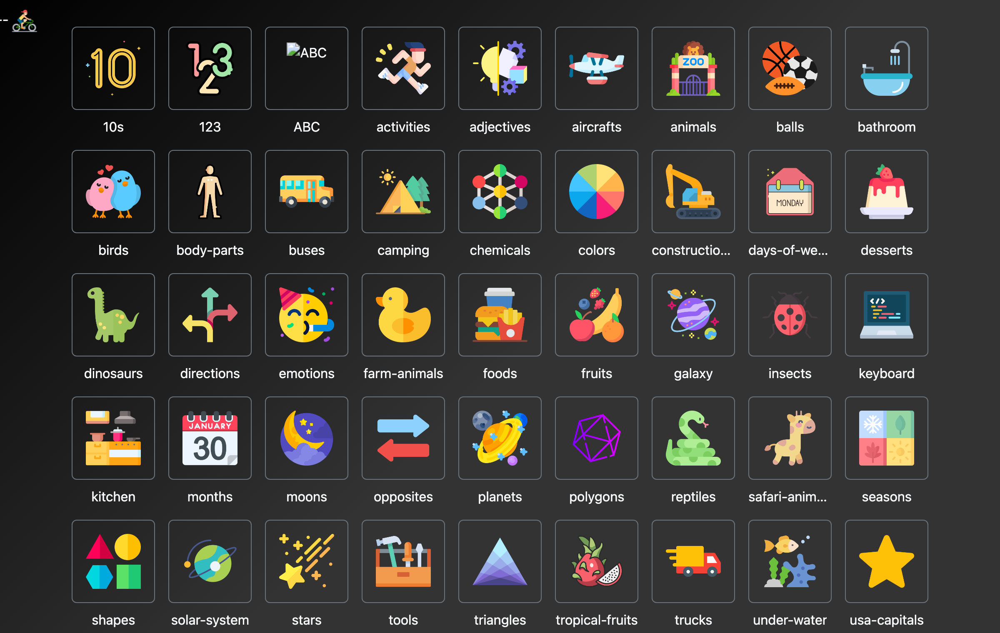
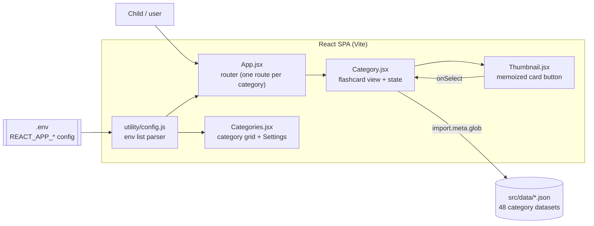

# Flash Cards

A static React app for picture-flashcard learning: browse a grid of categories, open one, and tap each card to hear its name spoken aloud, with sound effects, animations, and a progress counter that celebrates when every card is cleared. Built for young kids.



[](LICENSE)


## Contents

- [Features](#features)
- [Architecture](#architecture)
- [Tech stack](#tech-stack)
- [Quick start](#quick-start)
- [Configuration](#configuration)
- [Project layout](#project-layout)
- [Testing](#testing)
- [License](#license)

## Features

- Browse a grid of 48 picture-flashcard categories (animals, shapes, planets, vehicles, and more), driven entirely by config.
- Tap a card to hear its name spoken aloud via the Web Speech API, with a click sound and a spoken label.
- Progress counter (`x/y`) that tracks how many cards are cleared, with milestone flying-image animations at 1, 5, 10, 15, 20, and 25.
- Completion celebration that plays when every card is cleared, then returns home automatically.
- Keyboard selection: press any letter `a`-`z` to jump to the first card starting with that letter.
- Loading, empty, and error states so a missing dataset shows a message instead of a blank or crashing screen.
- Configurable home greeting and a background-image toggle (persisted in `localStorage`).
- Fully static: no backend, no database, deployable to any CDN.

## Architecture

Flash Cards is a single-page React app built with Vite. Routing generates one route per configured category, each category's static JSON dataset is lazy-loaded per route via `import.meta.glob` (its own chunk), and all interaction state lives in React - there is no server.



Three layers, one direction of flow:

| Layer     | Files                                            | Role                                                                  |
| --------- | ------------------------------------------------ | --------------------------------------------------------------------- |
| Routing   | `App.jsx`                                        | Builds one `<Route>` per configured category slug                     |
| Screens   | `Categories.jsx`, `Category.jsx`, `Settings.jsx` | Home grid, flashcard detail with progress/celebration, settings modal |
| Component | `Thumbnail.jsx`                                  | One memoized flashcard tile rendered as a native `<button>`           |
| Helpers   | `utility/config.js`, `utility/*`                 | Hardened env-list parser plus pure color/audio/page/image helpers     |
| Data      | `src/data/*.json`                                | 48 static category datasets, glob-loaded                              |

## Tech stack

- React 18 + React Router 6 (client-side routing)
- Vite 5 build tooling; Vitest + React Testing Library (unit/component) and Playwright (e2e)
- ESLint (react-hooks + jsx-a11y) and Prettier, both gated in CI
- Bootstrap 5 + plain CSS for styling; images served as WebP
- Web Speech API (`speechSynthesis`) for spoken labels
- Deployed as a static build (Vercel) with security + long-cache headers; CI via GitHub Actions

## Quick start

```bash
git clone https://github.com/bunlongheng/flash-cards.git
cd flash-cards
npm install
cp .env.example .env   # then fill in the values (see Configuration)
npm start              # http://localhost:3015
```

## Configuration

Copy `.env.example` to `.env` and set:

| Env var                          | Required | Purpose                                                                                                           |
| -------------------------------- | -------- | ----------------------------------------------------------------------------------------------------------------- |
| `REACT_APP_CATEGORIES`           | yes      | Comma-separated category slugs; one route + home tile per slug. Each must have a matching `src/data/<slug>.json`. |
| `REACT_APP_TRANSPORTATION_TYPES` | yes      | Comma-separated slugs for the random transportation banner on the home screen.                                    |
| `REACT_APP_GREETING`             | no       | Greeting shown on the home screen (defaults to `Hi!`).                                                            |

## Project layout

```
flash-cards/
  index.html            # Vite entry
  vite.config.js        # Vite + Vitest config (coverage gate)
  vercel.json           # SPA rewrites + security & long-cache headers
  eslint.config.js      # ESLint flat config (react-hooks + jsx-a11y)
  playwright.config.js  # e2e config (runs against the dev server)
  src/
    App.jsx             # Router (wrapped in an ErrorBoundary): one route per category
    ErrorBoundary.jsx   # Friendly fallback for render errors
    Categories.jsx      # Home grid + Settings modal
    Category.jsx        # Flashcard view: click/speak/progress/celebration
    Thumbnail.jsx       # Memoized native-button card tile
    Settings.jsx        # Background-image toggle
    utility/            # config (env parser), color, audio, page, image helpers
    data/               # 48 category datasets (*.json)
    *.test.{js,jsx}     # Vitest + React Testing Library suites
  public/               # images, sounds, fonts, icons
  NOTES.md              # how to add a new category
```

## Testing

```bash
npm run lint           # ESLint (react-hooks + jsx-a11y)
npm run format:check   # Prettier formatting check
npm test               # Vitest suite (27 tests, 11 suites)
npm run test:coverage  # with the coverage gate (85% statements/lines)
npm run test:e2e       # Playwright end-to-end smoke of the core flow
```

## License

[MIT](LICENSE) (c) Bunlong Heng
